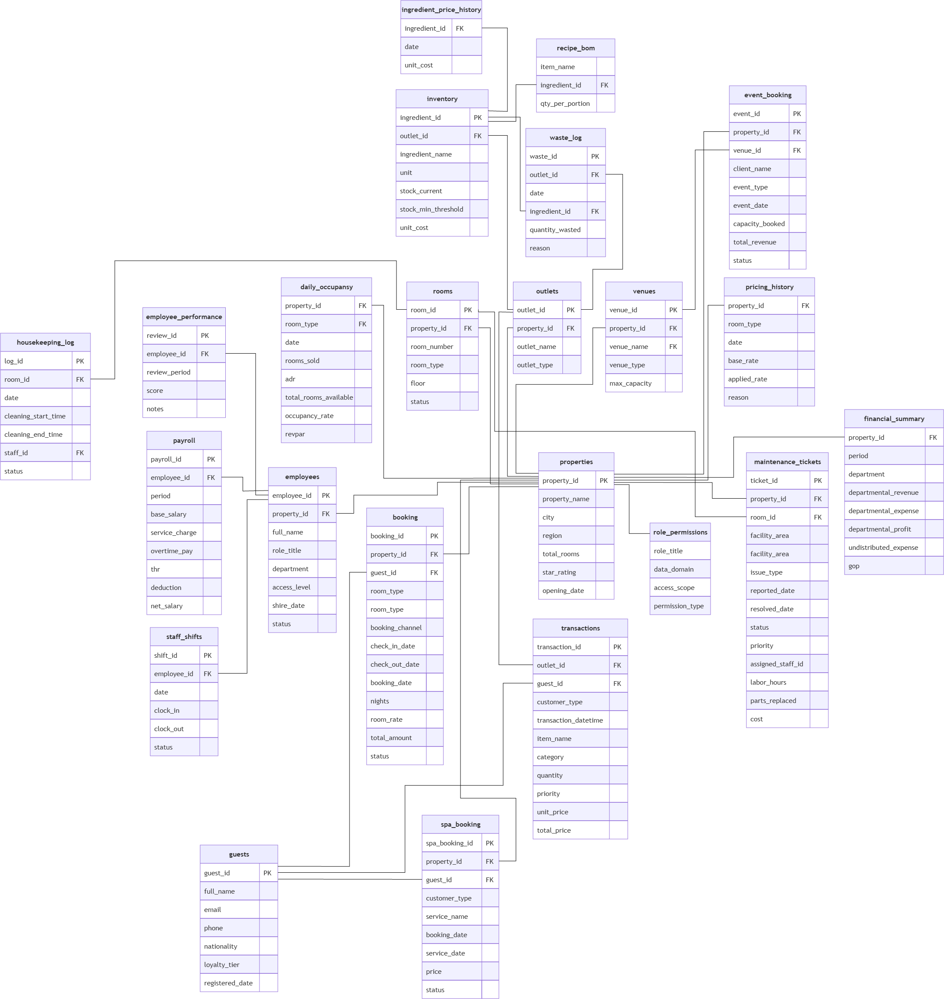

# Operational Database

# Question 

---

### 📊 รายได้และผลประกอบการ (Revenue & Performance)**

#### **1. Total Revenue & Nights Sold**
* **Question:** ภาพรวมผลประกอบการด้านรายได้รวม (Total Revenue) และจำนวนคืนที่มีการเข้าพักรวม (Total Nights Sold) ของโรงแรมทั้ง 5 สาขา อยู่ที่ระดับใด
* **Data Sources:** `fact_hotel_bookings`, `dim_date`, `dim_property`.
* **Business Value & Action Plan:** ประเมินขนาดธุรกิจและตั้งเป้าหมาย Sales Target / YoY Growth.

#### **2. Seasonality Trend (Revenue Trend)**
* **Question:** รูปแบบความผันผวนของรายได้ตามฤดูกาล (Seasonality Trend) ในรอบปี มีช่วง Peak Season และ Low Season ในเดือนใดบ้าง
* **Data Sources:** `fact_hotel_bookings`, `dim_date`, `dim_property`.
* **Business Value & Action Plan:** บริหารกำลังคน ปิดปรับปรุงช่วง Low Season และทำโปรโมชันพยุงรายได้.

#### **3. Weekday vs. Weekend Distribution**
* **Question:** สัดส่วนรายได้ระหว่างวันธรรมดา (Weekday) และวันหยุดสุดสัปดาห์ (Weekend) มีการกระจายตัวอย่างไร
* **Data Sources:** `fact_hotel_bookings`, `dim_date`, `dim_property`.
* **Business Value & Action Plan:** รักษาฐานกลุ่ม Corporate วันธรรมดา และออกแพ็กเกจ Staycation ดันสัดส่วนวันหยุด.

#### **4. Ancillary Services Growth Structure**
* **Question:** โครงสร้างรายได้และปริมาณผู้เข้าใช้บริการเสริม (Event & Venue, F&B, Spa & Wellness) มีสัดส่วนการเติบโตเป็นอย่างไร
* **Data Sources:** `fact_fnb_operations`, `fact_ancillary_services`, `dim_date`, `dim_property`.
* **Business Value & Action Plan:** ค้นหา Cash Cow และทำ Cross-selling Package เพิ่มรายได้ต่อหัว (RevPAS/RevPOR).

#### **5. Occupancy Rate Efficiency**
* **Question:** ประสิทธิภาพในการดำเนินงานด้านอัตราการเข้าพักเฉลี่ย (Occupancy Rate) ของแต่ละสาขามีความแตกต่างกันอย่างไร
* **Data Sources:** `fact_daily_occupancy`, `dim_property`.
* **Business Value & Action Plan:** ใช้ Dynamic Pricing กับสาขา Occupancy สูง และทำโปรโมชันกระตุ้นสาขาต่ำ.

---

### **👥 ลูกค้าและพฤติกรรม (Customer Analysis)**

#### **6. Loyalty Program Repeat Stay Trends**
* **Question:** อัตราการเข้าพักซ้ำมีแนวโน้มการเติบโตอย่างไรเมื่อจำแนกตามระดับสมาชิก (Loyalty Tier)
* **Data Sources:** `fact_hotel_bookings`, `dim_guest`, `dim_property`, `dim_date`.
* **Business Value & Action Plan:** ให้สิทธิประโยชน์เฉพาะกลุ่ม Gold/Platinum และกระตุ้นกลุ่ม None/Silver.

#### **7. Top 5 Geographic Nationalities**
* **Question:** โครงสร้างกลุ่มสัญชาตินักท่องเที่ยวหลัก (Top 5 Geographics) ที่สร้างยอดจองสูงสุดมีสัดส่วนเป็นอย่างไร
* **Data Sources:** `fact_hotel_bookings`, `dim_guest`, `dim_property`, `dim_date`.
* **Business Value & Action Plan:** เจาะกลุ่มประเทศหลักอย่าง Indonesia และตลาดยุโรป/ออสเตรเลียด้วย Performance Marketing.

#### **8. F&B vs. Spa Behavioral Differences**
* **Question:** พฤติกรรมการใช้บริการด้านอาหาร (Food) และสปา (Spa) มีความแตกต่างกันอย่างไรระหว่างกลุ่มลูกค้านักท่องเที่ยวในประเทศและต่างชาติ
* **Data Sources:** `fact_fnb_operations`, `fact_ancillary_services`, `dim_guest`, `dim_date`, `dim_property`.
* **Business Value & Action Plan:** ออกแพ็กเกจสปาสำหรับต่างชาติ และเมนูอาหารตอบโจทย์ลูกค้าในประเทศ.

#### **9. Average Length of Stay (ALOS)**
* **Question:** ระยะเวลาในการเข้าพักเฉลี่ยต่อครั้ง (Average Length of Stay) ของลูกค้าในแต่ละสาขามีสัดส่วนกี่คืน
* **Data Sources:** `fact_hotel_bookings`, `dim_guest`, `dim_property`, `dim_date`.
* **Business Value & Action Plan:** ทำโปรโมชัน "Long-stay Discount" ดันยอดคืนพักในสาขาที่มีค่าเฉลี่ยต่ำ.

---

### **🛏️ ห้องพักและการจอง (Room & Booking Patterns)**

#### **10. Booking Lead Time Patterns**
* **Question:** พฤติกรรมการวางแผนเดินทางของลูกค้าผ่านระยะเวลาการจองล่วงหน้าเฉลี่ย (Lead Time) มีระยะเวลากี่วัน
* **Data Sources:** `fact_hotel_bookings`, `dim_property`, `dim_date`.
* **Business Value & Action Plan:** กำหนดช่วงปล่อยโปรโมชัน "Early Bird" และ Last-minute pricing ใกล้วันเข้าพัก.

#### **11. Room Type Revenue & Booking Structure**
* **Question:** โครงสร้างรายได้และปริมาณยอดจองเมื่อจำแนกตามประเภทห้องพัก (Suite, Deluxe, Villa, Standard) มีลักษณะอย่างไร
* **Data Sources:** `fact_hotel_bookings`, `dim_room`, `dim_property`, `dim_date`.
* **Business Value & Action Plan:** ปรับ Room Mix และทำ Up-selling จาก Standard ไป Deluxe/Suite.

#### **12. Room Cancellation Risk Analysis**
* **Question:** สัดส่วนอัตราการยกเลิกการจอง (Cancellation Rate) ในแต่ละประเภทห้องพักมีระดับความเสี่ยงอย่างไร
* **Data Sources:** `fact_hotel_bookings`, `dim_room`, `dim_property`, `dim_date`.
* **Business Value & Action Plan:** กำหนดนโยบาย Non-refundable rate สำหรับห้องที่มีอัตราการยกเลิกสูง.

---

### **📅 ปฏิบัติการและสถานที่ (Operations & Venue)**

#### **13. Venue Utilization Volume**
* **Question:** พื้นที่จัดงานประเภทใด (Ballroom, Meeting Room, Outdoor) ที่ได้รับการจองใช้บริการสูงสุด
* **Data Sources:** `fact_ancillary_services`, `dim_venue`, `dim_property`, `dim_date`.
* **Business Value & Action Plan:** วางแผนปรับปรุง Ballroom ยอดจองสูงสุด และเพิ่มแพ็กเกจ Meeting Room/Outdoor.

#### **14. Event Type Frequency (High Volume)**
* **Question:** ประเภทของงานจัดเลี้ยง/ประชุม (Event Category) ใดที่มีความถี่ในการจัดงานสูงสุด
* **Data Sources:** `fact_ancillary_services`, `dim_event_type`, `dim_date`, `dim_property`.
* **Business Value & Action Plan:** มุ่งเน้น B2B Marketing เจาะกลุ่มลูกค้าองค์กรเพื่อสร้างยอดจองประชุมสม่ำเสมอ.

#### **15. Event Revenue Drivers (High Value)**
* **Question:** งานจัดเลี้ยงประเภทใดที่สร้างมูลค่ารายได้รวมสูงสุด (Revenue Drivers) ให้แก่โรงแรม
* **Data Sources:** `fact_ancillary_services`, `dim_event_type`, `dim_date`, `dim_property`.
* **Business Value & Action Plan:** ผลักดันงาน Wedding แพ็กเกจใหญ่ราคาสูงคู่กับงาน Corporate เพื่อสร้างกระแสเงินสด.